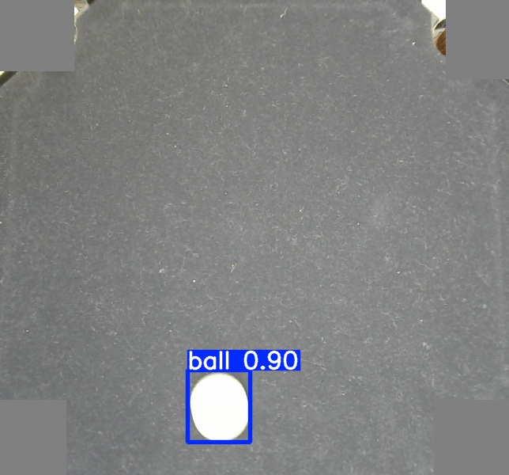
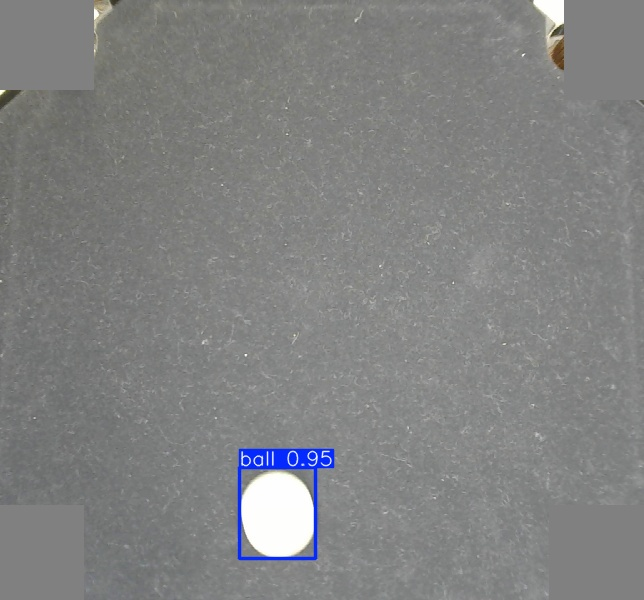
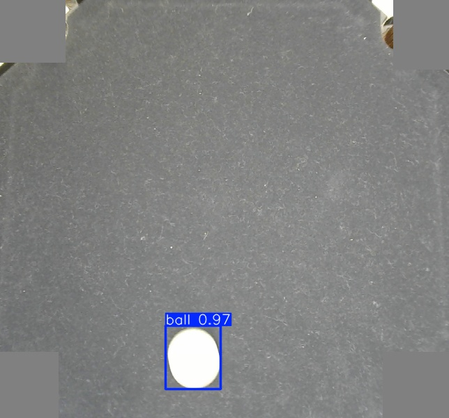

# Sphere Detection and Balancing with Neural Networks

## About the Project

This project was developed as part of my Master's program.  
It focuses on **detecting and tracking spherical objects (balls)** using both  
**deep learning–based object detection models** and **classical computer vision methods**.  
The detected position is used in a **PID control loop** to balance a ball on a movable platform.   

---

## Project Goals

- **Data Acquisition & Labeling**  
  - Record sequences, convert to YOLO-format, validate annotations.  

- **Model Training**  
  - Train and compare YOLOv5, YOLOv8, RT-DETR.  

- **Evaluation & Benchmarking**  
  - Precision, Recall, mAP metrics + inference speed.  

- **Control Integration**  
  - PID loop with CV and DL trackers.  

- **Deployment**  
  - Optimize models (ONNX / TensorRT) for NVIDIA Jetson.  

---

## Repository Structure

```plaintext
project/
├── src/                  # Source code
│   ├── control/          # PID control (CV & DL)
│   ├── trackers/         # Ball trackers (classical & DL)
│   ├── hardware/         # Sensor drivers (ADXL345, MCP4728)
│   └── app/              # Entry point (main.py)
├── data/
│   ├── recordings/       # Extracted recordings
│   └── datasets/         # YOLO-ready datasets
├── models/               # Trained models (best.pt, best.pth, …)
├── experiments/          # Training notebooks & results
│   ├── train_yolov5/
│   ├── train_yolov8/
│   └── train_rtdetr/
├── tools/                # Utility scripts (label viewers, dataset builder)
├── results/              # Evaluation plots & qualitative predictions
└── README.md
```

---

## Results

### Quantitative Results

All three models achieved excellent detection performance on the dataset.  

| Model     | Precision | Recall | mAP@0.5 | mAP@0.5:0.95 | FPS (Jetson) |
|-----------|-----------|--------|---------|--------------|--------------|
| YOLOv5m   | 1.000     | 1.000  | 0.995   | 0.933        | ~28.5        |
| YOLOv8m   | 0.999     | 1.000  | 0.995   | 0.982        | ~28.5        |
| RT-DETR-L | 0.988     | 1.000  | 0.995   | 0.978        | ~24.1        |

➡️ **YOLOv8m** delivered the best overall balance of accuracy and robustness.  

---  

### Qualitative Results

Predictions from each model (example frames):  

<p align="center">
  <div style="display:inline-block; text-align:center; margin: 10px;">
    <br>
    <b>YOLOv5m</b>
  </div>
  <div style="display:inline-block; text-align:center; margin: 10px;">
    <br>
    <b>YOLOv8m</b>
  </div>
  <div style="display:inline-block; text-align:center; margin: 10px;">
    <br>
    <b>RT-DETR-L</b>
  </div>
</p>


---

### Classical vs. Deep Learning

- **Classical CV**:  
  - Very fast (30–40 FPS), but sensitive to lighting/reflections.  

- **Deep Learning**:  
  - Robust across conditions, ~25–28 FPS on Jetson, requires GPU + dataset.  

---

## Downloads

- [Dataset v1.0](https://github.com/Lukas-Kayk/SphereDetectionNN/releases/tag/v1.0-dataset)
- [YOLOv5m best.pt](https://github.com/Lukas-Kayk/SphereDetectionNN/releases/download/v1.0-yolov5/best_yolov5_m.pt)
- [YOLOv8m best.pt](https://github.com/Lukas-Kayk/SphereDetectionNN/releases/download/v1.0-yolov8/best_yolov8_m.pt)
- [RT-DETR-L best.pth](https://github.com/Lukas-Kayk/SphereDetectionNN/releases/download/v1.0-rtdetr/best_rtdetr_l.pth)

---

## Milestones

- [x] Data acquisition and labeling  
- [x] Dataset conversion to YOLO format  
- [x] Model training (YOLOv5, YOLOv8, RT-DETR)  
- [x] Evaluation and benchmark comparison  
- [ ] Deployment optimization for Jetson  
- [x] Final thesis report (in German)  
- [ ] English project documentation for GitHub  

---

## Documentation

- [Final Report (German)](report/MLD_Projekt_DE.pdf)
- [Project Documentation (English, in progress)](report/MLD_Projekt_EN.pdf)

---

## Portfolio Value

This project demonstrates skills in:  
- Deep learning for real-time object detection  
- Dataset preparation and labeling  
- Model evaluation and comparison  
- PID control integration with CV/DL trackers  
- Embedded deployment on NVIDIA Jetson  

---

## License

This project is licensed under the MIT License – see the [LICENSE](LICENSE) file for details.

